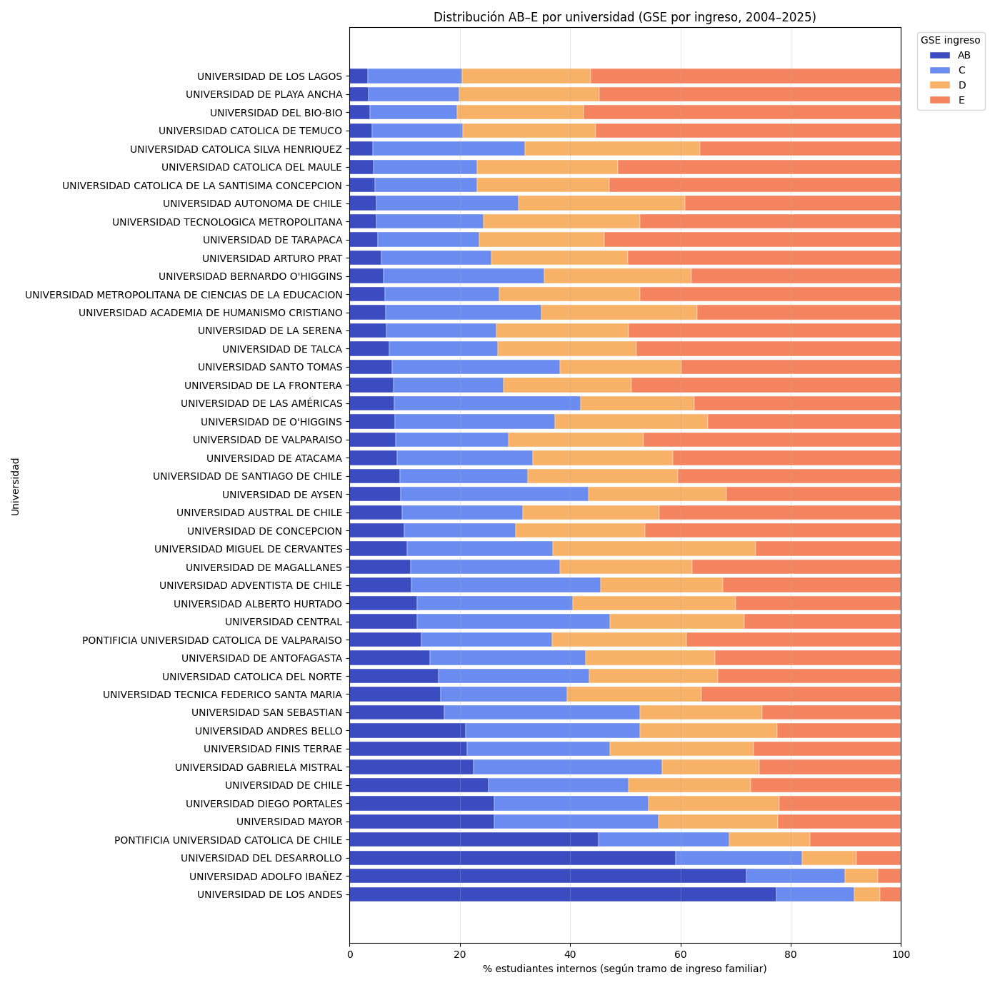

# Pregunta 3 Distribucion socioeconomica por universidad con DEMRE 2004 a 2025

Proyecto academico grupal IMT 2200  
Este repositorio resume mi aporte en la Pregunta 3

## Resumen
Analice como se distribuyen los estudiantes que ingresan a la educacion superior segun grupo socioeconomico usando ingreso familiar en datos DEMRE entre 2004 y 2025

## Highlights
- Distribucion porcentual por universidad para los grupos AB C D E
- Promedio del periodo 2004 a 2025 para ver una composicion estable por institucion
- Orden de universidades por porcentaje del grupo AB para comparar mejor

## Grafico principal


## Metodologia
1. Desde el campo ingreso familiar extraje un tramo numerico entre 1 y 12
2. Agrupe tramos en cuatro grupos socioeconomicos
   - 1 a 2 corresponde a E
   - 3 a 4 corresponde a D
   - 5 a 8 corresponde a C
   - 9 a 12 corresponde a AB
3. Para cada universidad conte estudiantes por grupo
4. Transforme los conteos a porcentajes de modo que por universidad suma 100
5. Promedie los resultados en el periodo 2004 a 2025
6. Ordene universidades por porcentaje del grupo AB de mayor a menor

## Interpretacion y conclusión
El grafico muestra para cada universidad el porcentaje de estudiantes matriculados que pertenecen a cada grupo socioeconomico AB C D E  
Se observa una fuerte desigualdad  
Las universidades mas selectivas y privadas concentran una mayor proporcion de estudiantes en los grupos AB y C  
Muchas universidades tienen mayoria de estudiantes en los grupos D y E  
Esto se mantiene casi igual durante el periodo 2004 a 2025  
El acceso universitario sigue estando fuertemente asociado al nivel de ingreso familiar

## Archivos
- notebooks/Pregunta3.ipynb
- requirements.txt
- graficos-imagenes/pregunta3.png

## Datos
Los datos se obtienen desde DEMRE Portal de Transparencia o desde el link compartido por el equipo en el repositorio grupal  
Este repositorio no incluye datasets solo codigo y analisis

## Como ejecutar
```bash
pip install -r requirements.txt
jupyter notebook
